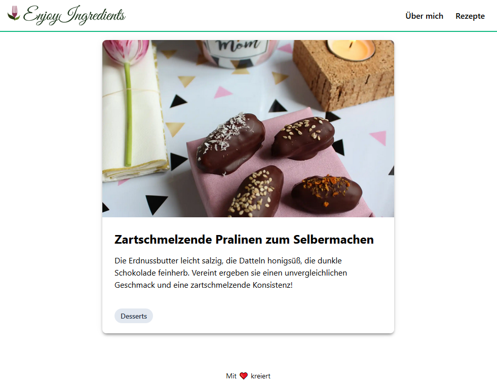

# EnjoyIngredients

The frontend for a blogging website with a headless Ghost CMS.



## 🚀 Quick start

Node.js (^12.10) and Docker need to be installed on your system.

1. **Start ghost**

    ```shell
    docker-compose up -d
    ```

2. **Finish the setup of Ghost**

   Open http://localhost:2368/ghost/ in your browser and finish the setup there.

3. **Update the Content API key**

   Add a integration for Gatsby in Ghost (http://localhost:2368/ghost/#/settings/integrations/new) and copy the generated Content API Key into `.ghost.json`.

4. **Start the Blog**

   ```shell
   npm start
   ```

5. **Open the source code and start editing!**

   The site is now running at `http://localhost:8000`.

   The GraphQL Tool can be accessed at `http://localhost:8000/___graphql`.
